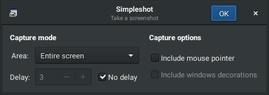

# Simpleshot

**Work In Progress**

This is an easy-to-use and barebones Linux screenshot tool with a GTK interface. I am creating this software because I was unable to find one that satisfied all of my needs while remaining simple and light.

&emsp;

## Features

+ Screenshot capture modes
	+ Entire screen
	+ Active window
	+ Selected region
+ Delay
	+ Set delay in seconds to wait before taking a screenshot
	+ Disable delay with a single checkbox
+ Capture options
	+ Include/exclude mouse pointer
	+ Include/exclude window decorations
+ Screenshot actions
	+ Save to a PNG file
	+ Copy to clipboard
	+ Open with a desired application
	+ Host on an image hosting service
		+ Imgur

## Does not work / needs improvements

+ Window decorations inclusion/exclusion &mdash; bad implementation
+ Mouse pointer inclusion &mdash; not implemented
+ Hosting on image hosting services (currently just Imgur) &mdash; not implemented

## ToDo

+ Implement/fix features
+ Reorganize project structure
+ Make a proper build and install system
+ Publish on different distribution repositories (Arch first, others might follow if requested)
